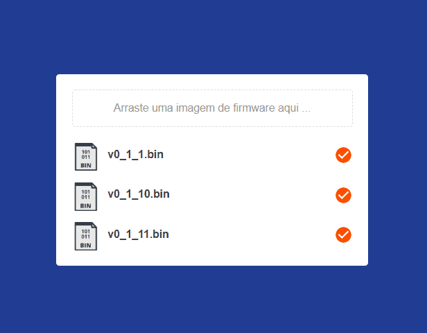

<p align="">
    <a alt="Node">
        
    </a>
    <a alt="React">
        
    </a>     
    <a alt="Docker">
        
    </a>
</p>

# OTA Server - Easy firmware update 

##### Express server and React web App to managing and automatically deploy the last version firmware to IoT embedded devices.

### About

This project it is being developed to be a very simple solution to the problem of managing firmware files in IoT projects. In the context of IoT, the Over-The-Air update, called OTA, makes it easier to update devices, as it allows sending firmware and software updates to devices remotely. Click [here](https://gist.github.com/davicedraz/b40131306a3ea6670712defef6f0e3d1) to see my gist showing how to enable OTA update on one of those devices.

Therefore, there is a simple set of rules that dictate how version numbers are assigned and incremented on build files. For example: consider the version format X.Y.Z. Correction of faults (bug fixes) that do not affect the system, increases the space X, additions / changes compatible with previous versions of the software or firmware increases the Y, and incompatible changes with previous versions increases the Z.

Based on that, at the moment, this is what the system proposes to do:

- [ ] Login and Signup
- [x] CRUD (Create, Read, Update and Delete) of a firmware file with the name of the project, version and name of the compatible board;
- [x] Present the list of all firmwares files (.bin) by project and board
- [x] Makes available for donwload all firmware files (without TLS, yet)
- [ ] Makes available for donwload in a safe way with TLS
- [x] The name of the firmware is always saved with the format: project_name_v0_0_1.bin
- [x] The system does not accept uploading a file in a format other than .bin
- [x] The file version reflects the Major, Minor and Correction (Patch) version

<p align="center">

</p>

## Setup

On the server directory, create the file .env and set the following properties as you need:

``` bash
# ENV is the enviroment variable to project context, should be 'development' or 'production'
ENV=development

# SERVER_PORT has to be the URL where this server runs
SERVER_PORT=8001

# MAX_SIZE limit the size of firmware in megabytes to a firmware binary deployed
MAX_SIZE=1
```

## Development

Inside the server and app directories, install dependencies:
``` bash
$ npm install
```

Start the express server (inside ./server folder)
``` bash 
$ npm start
```

Start the React app (inside ./app folder)
``` bash 
$ npm start
```

## Build & Deploy

Build and run the docker compose:

```bash
$ docker-compose up -d
```

## Example of usage

#### Deploy a new firmware file

- [POST]
- Route: http://localhost:8001/deploy
- Content-Type: multipart/form-data
- Body:
    ```JSON
    {
        "project": "project_name",
        "board": "esp_01m",  
        "version": "0_0_1" 
    }
    ```
- File: 
    ``` JSON
    firmware: file.bin
    ```

#### Update via OTA

- [GET]
- Route: http://localhost:8001/update/project_name/board_type
- Content-Type: application/json
- Headers:
    - x-ESP8266-version: 0_0_1
    - x-ESP8266-mode: sketch
    - x-ESP8266-chip-size: 1000000
